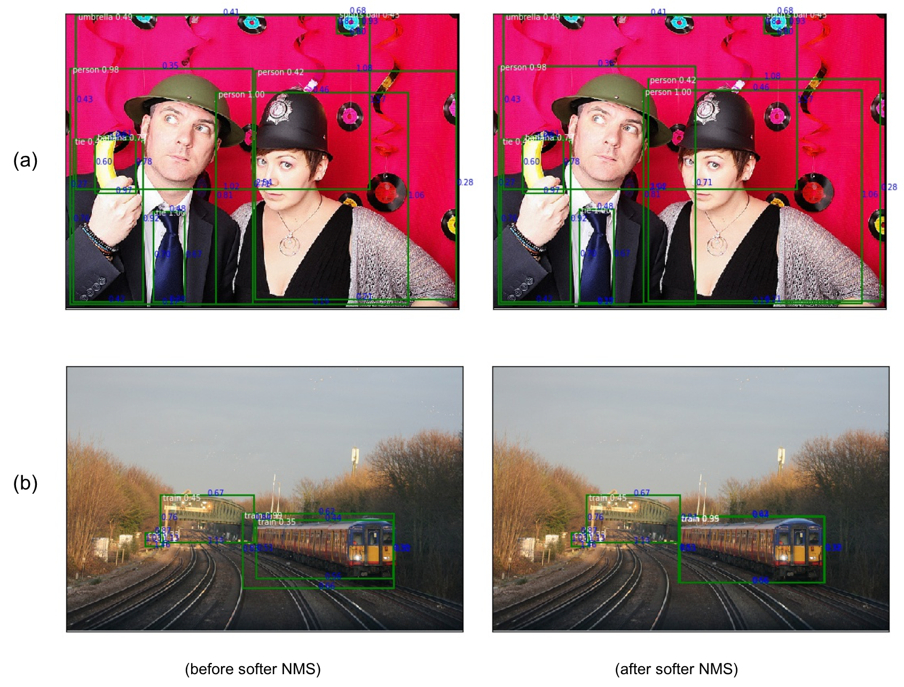

## Deprecated. Please see our CVPR 2019 paper: [Bounding Box Regression with Uncertainty for Accurate Object Detection](https://github.com/yihui-he/KL-Loss)

# [Softer-NMS: Rethinking Bounding Box Regression for Accurate Object Detection](https://arxiv.org/abs/1809.08545)
[Yihui He](http://yihui-he.github.io/), [Xiangyu Zhang](https://scholar.google.com/citations?user=yuB-cfoAAAAJ&hl=en&oi=ao) , [Kris Kitani](http://www.cs.cmu.edu/~kkitani/) and [Marios Savvides](http://www.cmu-biometrics.org), Carnegie Mellon University

We introduce a novel bounding box regression loss for learning bounding box transformation and localization variance together. The resulting localization variance is utilized in our new non-maximum suppression method to improve localization accuracy for object detection. On MS-COCO, we boost the AP of VGG-16 faster R-CNN from 23.6% to **29.1%** with a single model and nearly no additional computational overhead. More importantly, our method improves the AP of ResNet-50 FPN fast R-CNN from 36.8% to **37.8%**, which achieves state-of-the-art bounding box refinement result.

<div align="center">
  
</div>

### Citation
If you find the code useful in your research, please consider citing:

    @article{softernms,
      title={Softer-NMS: Rethinking Bounding Box Regression for Accurate Object Detection},
      author={He, Yihui and Zhang, Xiangyu and Kitani, Kris and Savvides, Marios},
      journal={arXiv preprint arXiv:1809.08545},
      year={2018}
    }

### Installation  
Please find installation instructions for Caffe2 and Detectron in [`INSTALL.md`](INSTALL.md).

### Testing
Running inference using `$N` GPUs (e.g., `N=8`).

```
python2 tools/test_net.py \
    --cfg configs/12_2017_baselines/fast_rcnn_R-50-FPN_2x_our.yaml \
    --multi-gpu-testing \
    NUM_GPUS $N
```

### Training
Training with 8 GPUs:
```
python2 tools/train_net.py \
    --cfg configs/12_2017_baselines/fast_rcnn_R-50-FPN_2x_our.yaml \
    OUTPUT_DIR /tmp/detectron-output
```

to train the initialization model:

```
python2 tools/train_net.py \
    --cfg configs/12_2017_baselines/fast_rcnn_R-50-FPN_2x_init.yaml \
    OUTPUT_DIR /tmp/detectron-output
```

### Customization
If you want to integrate softer-NMS into your own code, you can find all modifications to [`detectron/`](https://github.com/yihui-he/softer-NMS/tree/master/detectron) at lines with flags: `XYXY, PRED_STD, STD_NMS`.

If you want to train your own model, Create two configs similar to these two:
First, in [`_init.yaml`](https://github.com/yihui-he/softer-NMS/blob/master/configs/12_2017_baselines/fast_rcnn_R-50-FPN_2x_init.yaml#L39) config, you need to add:

    XYXY: True
    PRED_STD: False
    STD_NMS: False

Other staffs remain the same.

Second, in [`_our.yaml`](https://github.com/yihui-he/softer-NMS/blob/master/configs/12_2017_baselines/fast_rcnn_R-50-FPN_2x_our.yaml#L40) config, you need:

    XYXY: True
    PRED_STD: True
    STD_NMS: True

Learning rate should be changed accordingly (see [here](https://github.com/yihui-he/softer-NMS/blob/master/configs/12_2017_baselines/fast_rcnn_R-50-FPN_2x_our.yaml#L9)). `TRAIN.WEIGHTS` should be the path to the output of `_init.yaml`.

### FAQ
Please create a [new issue](https://github.com/yihui-he/softer-NMS/issues/new).

-------------------------------------------

# Detectron

Detectron is Facebook AI Research's software system that implements state-of-the-art object detection algorithms, including [Mask R-CNN](https://arxiv.org/abs/1703.06870). It is written in Python and powered by the [Caffe2](https://github.com/caffe2/caffe2) deep learning framework.

At FAIR, Detectron has enabled numerous research projects, including: [Feature Pyramid Networks for Object Detection](https://arxiv.org/abs/1612.03144), [Mask R-CNN](https://arxiv.org/abs/1703.06870), [Detecting and Recognizing Human-Object Interactions](https://arxiv.org/abs/1704.07333), [Focal Loss for Dense Object Detection](https://arxiv.org/abs/1708.02002), [Non-local Neural Networks](https://arxiv.org/abs/1711.07971), [Learning to Segment Every Thing](https://arxiv.org/abs/1711.10370), [Data Distillation: Towards Omni-Supervised Learning](https://arxiv.org/abs/1712.04440), [DensePose: Dense Human Pose Estimation In The Wild](https://arxiv.org/abs/1802.00434), and [Group Normalization](https://arxiv.org/abs/1803.08494).

<div align="center">
  
  <p>Example Mask R-CNN output.</p>
</div>

## Introduction

The goal of Detectron is to provide a high-quality, high-performance
codebase for object detection *research*. It is designed to be flexible in order
to support rapid implementation and evaluation of novel research. Detectron
includes implementations of the following object detection algorithms:

- [Mask R-CNN](https://arxiv.org/abs/1703.06870) -- *Marr Prize at ICCV 2017*
- [RetinaNet](https://arxiv.org/abs/1708.02002) -- *Best Student Paper Award at ICCV 2017*
- [Faster R-CNN](https://arxiv.org/abs/1506.01497)
- [RPN](https://arxiv.org/abs/1506.01497)
- [Fast R-CNN](https://arxiv.org/abs/1504.08083)
- [R-FCN](https://arxiv.org/abs/1605.06409)

using the following backbone network architectures:

- [ResNeXt{50,101,152}](https://arxiv.org/abs/1611.05431)
- [ResNet{50,101,152}](https://arxiv.org/abs/1512.03385)
- [Feature Pyramid Networks](https://arxiv.org/abs/1612.03144) (with ResNet/ResNeXt)
- [VGG16](https://arxiv.org/abs/1409.1556)

Additional backbone architectures may be easily implemented. For more details about these models, please see [References](#references) below.

## Update

- 4/2018: Support Group Normalization - see [`GN/README.md`](./projects/GN/README.md)

## License

Detectron is released under the [Apache 2.0 license](https://github.com/facebookresearch/detectron/blob/master/LICENSE). See the [NOTICE](https://github.com/facebookresearch/detectron/blob/master/NOTICE) file for additional details.

## Citing Detectron

If you use Detectron in your research or wish to refer to the baseline results published in the [Model Zoo](MODEL_ZOO.md), please use the following BibTeX entry.

```
@misc{Detectron2018,
  author =       {Ross Girshick and Ilija Radosavovic and Georgia Gkioxari and
                  Piotr Doll\'{a}r and Kaiming He},
  title =        {Detectron},
  howpublished = {\url{https://github.com/facebookresearch/detectron}},
  year =         {2018}
}
```

## Model Zoo and Baselines

We provide a large set of baseline results and trained models available for download in the [Detectron Model Zoo](MODEL_ZOO.md).

## Installation

Please find installation instructions for Caffe2 and Detectron in [`INSTALL.md`](INSTALL.md).

## Quick Start: Using Detectron

After installation, please see [`GETTING_STARTED.md`](GETTING_STARTED.md) for brief tutorials covering inference and training with Detectron.

## Getting Help

To start, please check the [troubleshooting](INSTALL.md#troubleshooting) section of our installation instructions as well as our [FAQ](FAQ.md). If you couldn't find help there, try searching our GitHub issues. We intend the issues page to be a forum in which the community collectively troubleshoots problems.

If bugs are found, **we appreciate pull requests** (including adding Q&A's to `FAQ.md` and improving our installation instructions and troubleshooting documents). Please see [CONTRIBUTING.md](CONTRIBUTING.md) for more information about contributing to Detectron.

## References

- [Data Distillation: Towards Omni-Supervised Learning](https://arxiv.org/abs/1712.04440).
  Ilija Radosavovic, Piotr Dollár, Ross Girshick, Georgia Gkioxari, and Kaiming He.
  Tech report, arXiv, Dec. 2017.
- [Learning to Segment Every Thing](https://arxiv.org/abs/1711.10370).
  Ronghang Hu, Piotr Dollár, Kaiming He, Trevor Darrell, and Ross Girshick.
  Tech report, arXiv, Nov. 2017.
- [Non-Local Neural Networks](https://arxiv.org/abs/1711.07971).
  Xiaolong Wang, Ross Girshick, Abhinav Gupta, and Kaiming He.
  Tech report, arXiv, Nov. 2017.
- [Mask R-CNN](https://arxiv.org/abs/1703.06870).
  Kaiming He, Georgia Gkioxari, Piotr Dollár, and Ross Girshick.
  IEEE International Conference on Computer Vision (ICCV), 2017.
- [Focal Loss for Dense Object Detection](https://arxiv.org/abs/1708.02002).
  Tsung-Yi Lin, Priya Goyal, Ross Girshick, Kaiming He, and Piotr Dollár.
  IEEE International Conference on Computer Vision (ICCV), 2017.
- [Accurate, Large Minibatch SGD: Training ImageNet in 1 Hour](https://arxiv.org/abs/1706.02677).
  Priya Goyal, Piotr Dollár, Ross Girshick, Pieter Noordhuis, Lukasz Wesolowski, Aapo Kyrola, Andrew Tulloch, Yangqing Jia, and Kaiming He.
  Tech report, arXiv, June 2017.
- [Detecting and Recognizing Human-Object Interactions](https://arxiv.org/abs/1704.07333).
  Georgia Gkioxari, Ross Girshick, Piotr Dollár, and Kaiming He.
  Tech report, arXiv, Apr. 2017.
- [Feature Pyramid Networks for Object Detection](https://arxiv.org/abs/1612.03144).
  Tsung-Yi Lin, Piotr Dollár, Ross Girshick, Kaiming He, Bharath Hariharan, and Serge Belongie.
  IEEE Conference on Computer Vision and Pattern Recognition (CVPR), 2017.
- [Aggregated Residual Transformations for Deep Neural Networks](https://arxiv.org/abs/1611.05431).
  Saining Xie, Ross Girshick, Piotr Dollár, Zhuowen Tu, and Kaiming He.
  IEEE Conference on Computer Vision and Pattern Recognition (CVPR), 2017.
- [R-FCN: Object Detection via Region-based Fully Convolutional Networks](http://arxiv.org/abs/1605.06409).
  Jifeng Dai, Yi Li, Kaiming He, and Jian Sun.
  Conference on Neural Information Processing Systems (NIPS), 2016.
- [Deep Residual Learning for Image Recognition](http://arxiv.org/abs/1512.03385).
  Kaiming He, Xiangyu Zhang, Shaoqing Ren, and Jian Sun.
  IEEE Conference on Computer Vision and Pattern Recognition (CVPR), 2016.
- [Faster R-CNN: Towards Real-Time Object Detection with Region Proposal Networks](http://arxiv.org/abs/1506.01497)
  Shaoqing Ren, Kaiming He, Ross Girshick, and Jian Sun.
  Conference on Neural Information Processing Systems (NIPS), 2015.
- [Fast R-CNN](http://arxiv.org/abs/1504.08083).
  Ross Girshick.
  IEEE International Conference on Computer Vision (ICCV), 2015.
